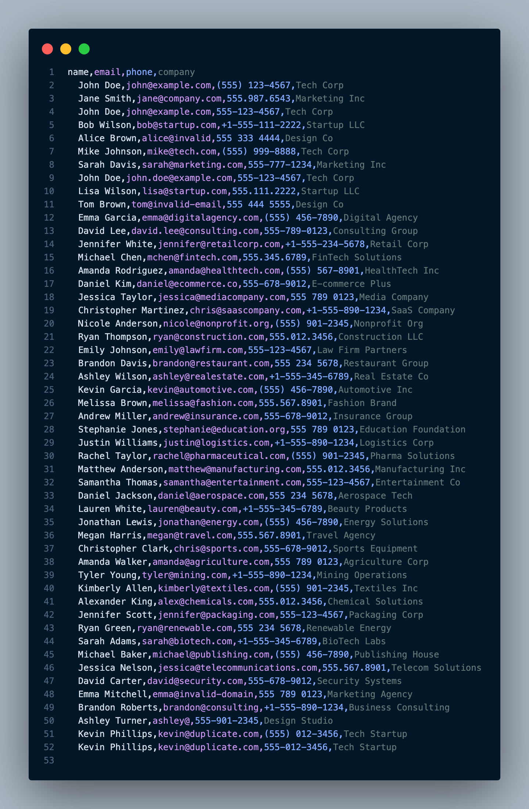
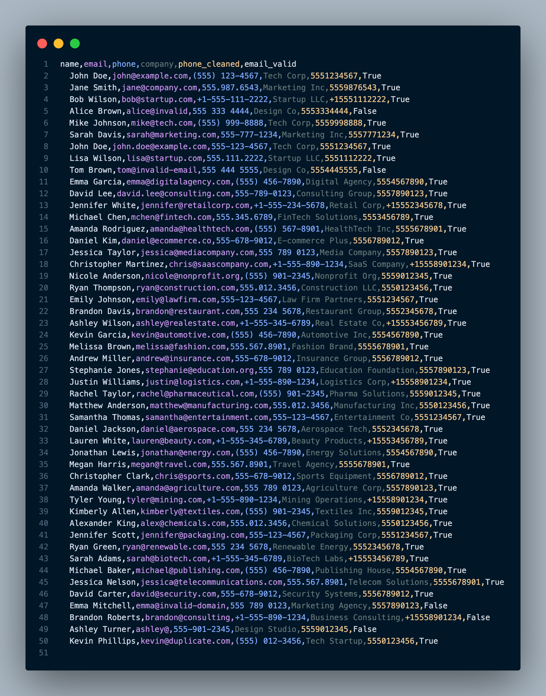

# CSV Contact Cleaner

**Professional business contact cleaning and validation tool**

[](https://python.org)
[](LICENSE)

---

## 🚀 Overview

CSV Contact Cleaner is a robust, production-ready Python tool for cleaning, validating, and standardizing business contact lists. Perfect for sales, marketing, CRM imports, and data enrichment projects.

- **Removes duplicates and invalid entries**
- **Standardizes names, emails, and phone numbers**
- **Detects and fixes common data issues**
- **Exports clean, ready-to-use CSV files**
- **Includes demo data and example scripts**

## ✨ Features

- Bulk cleaning of business contact CSV files
- Email and phone validation
- Name and company normalization
- Customizable cleaning rules
- Fast and easy to use
- 100% open source (MIT License)

## 📦 Quick Start

### 1. Clone the repository
```bash
git clone https://github.com/yourusername/csv-contact-cleaner.git
cd csv-contact-cleaner
```

### 2. Create a virtual environment and install dependencies
```bash
python3 -m venv venv
source venv/bin/activate
pip install -r src/requirements.txt
```

### 3. Generate demo data (optional)
```bash
python examples/generate_demo_contacts.py
```

### 4. Clean your contacts
```bash
python src/business_contact_cleaner.py --input data/demo_contacts.csv --output data/cleaned_contacts.csv
```

## 📝 Example

**Input:**
```
Name,Email,Phone,Company,Position
John Doe,john.doe@example.com,555-1234,Acme Inc,Manager
Jane Smith,janesmith@invalid,123456,Widgets LLC,CEO
...
```

**Output:**
```
Name,Email,Phone,Company,Position
John Doe,john.doe@example.com,555-1234,Acme Inc,Manager
```

## 📂 Project Structure
```
csv-contact-cleaner/
├── data/                  # Example and output data
│   └── demo_contacts.csv
├── docs/                  # Documentation
├── examples/              # Example scripts
│   └── generate_demo_contacts.py
├── screenshots/           # Screenshots for portfolio
├── src/                   # Source code
│   ├── business_contact_cleaner.py
│   └── requirements.txt
├── README.md
├── LICENSE
```

## 🖼️ Screenshots

| Before Cleaning | After Cleaning |
|-----------------|---------------|
|  |  |

## 🛠️ Technologies
- Python 3.8+
- pandas
- faker (for demo data)

## 📄 License

This project is licensed under the MIT License - see the [LICENSE](LICENSE) file for details.

## 💼 Use Cases
- CRM data import
- Sales and marketing campaigns
- Data enrichment
- Lead generation
- Portfolio showcase

## 🤝 Contributing
Pull requests are welcome! For major changes, please open an issue first to discuss what you would like to change.

---

**Built for business data quality and professional portfolios.**